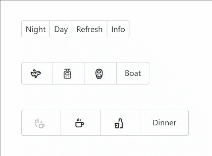

# Radio Component

The Radio component in ComponentX is a fundamental UI element that allows 
users to select a single option from a set of mutually exclusive choices. 
It is composed of two main parts: the [Radio Group](#radio-group) and the [Radio Option](#radio-option).

## Radio Group

The Radio Group component is responsible for managing a group of 
radio options and handling the selection state. It provides a container 
for the radio options and facilitates communication between them.



### Props

The following props can be used with the RadioGroup component:

- **size** (optional): Specifies the size of the radio group. Choose between small, medium and large.
- **name**: Specifies the name of the radio group. This is used to group the radio options together.
- **multiple** (optional): A boolean, which indicates whether multiple options can be selected within the radio group.
- **callback**: A callback function called when an option is selected.

## Radio Option

The Radio Option component represents an individual radio 
option within the Radio Group. It is responsible for rendering 
the option and handling user interactions.

### Props

The following props can be used with the RadioOption component:

- **value**: The value of the radio option.
- **label** (optional): The label associated with the radio option.
- **selected** (optional): Indicates whether the option is selected.
- **noToolTip** (optional): A boolean, which indicates whether the tooltip is disabled for the radio option.
- **disabled** (optional): A boolean, which indicates whether the option is disabled.

## Using Radio Component in Vue

1. Import the RadioGroup and RadioOption components from ComponentX:
```ts
import RadioGroup from "@alexbeck2911/componentx/output/vue/vue3/src/components/radio/radio-group-component.vue";
import RadioOption from "@alexbeck2911/componentx/output/vue/vue3/src/components/radio/radio-option-component.vue";
```
2. Create a Vue component and use the RadioGroup and RadioOption components within it:
```vue
<radio-group :callback="handleRadioOptionSelected" size="large" name="exampleVue">
  <radio-option value="night" label="Night">Night</radio-option>
  <radio-option value="day" label="Day">Day</radio-option>
  <radio-option value="refresh" label="Refresh">Refresh</radio-option>
  <radio-option value="info" no-tool-tip=true disabled=true>Info</radio-option> 
</radio-group>
```

## Using Radio Component in React

1. Import the RadioGroup and RadioOption components from ComponentX:
```ts
import RadioGroupComponent from "@alexbeck2911/componentx/output/react/src/components/radio/radio-group-component.jsx";
import RadioOptionComponent from "@alexbeck2911/componentx/output/react/src/components/radio/radio-option-component.jsx";
```
2. Create a React component and use the RadioGroup and RadioOption components within it:
```tsx
<RadioGroupComponent size="small" callback={handleClick} name="exampleReact">
  <RadioOptionComponent value="night" label={"Night"}>Night</RadioOptionComponent>
  <RadioOptionComponent value="day" label={"Day"}>Day</RadioOptionComponent>
  <RadioOptionComponent value="refresh" label={"Refresh"}>Refresh</RadioOptionComponent>
  <RadioOptionComponent value="info" noToolTip={true} disabled={true}>Info</RadioOptionComponent>
</RadioGroupComponent>
```

## Using Radio Component in Angular

The radio component is currently not supported by angular.